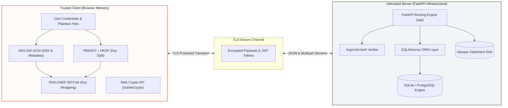

<div align="center">

```text
██╗   ██╗ █████╗ ██╗   ██╗██╗  ████████╗██╗     ██╗███╗   ██╗███████╗
██║   ██║██╔══██╗██║   ██║██║  ╚══██╔══╝██║     ██║████╗  ██║██╔════╝
██║   ██║███████║██║   ██║██║     ██║   ██║     ██║██╔██╗ ██║█████╗  
╚██╗ ██╔╝██╔══██║██║   ██║██║     ██║   ██║     ██║██║╚██╗██║██╔══╝  
 ╚████╔╝ ██║  ██║╚██████╔╝███████╗██║   ███████╗██║██║ ╚████║███████╗
  ╚═══╝  ╚═╝  ╚═╝ ╚═════╝ ╚══════╝╚═╝   ╚══════╝╚═╝╚═╝  ╚═══╝╚══════╝
```

### **Zero-Knowledge Encrypted File Vault with Cryptographic Envelope Sharing**

*A modern web vault that guarantees true end-to-end privacy through client-side Web Crypto primitives, multi-party envelope encryption, and mathematically isolated access control.*

[](https://react.dev/)
[](https://fastapi.tiangolo.com/)
[](https://developer.mozilla.org/en-US/docs/Web/API/Web_Crypto_API)
[](https://www.postgresql.org/)
[](docs/TESTING.md)
[](STATUS.md)

[Guided Walkthrough (`/demo`)](http://localhost:5173/demo) • [System Architecture](docs/ARCHITECTURE.md) • [Security Threat Model](docs/SECURITY.md) • [API Specification](docs/API_REFERENCE.md) • [Evaluation Guide](docs/DEMO_GUIDE.md) • [Team Journal](journals/COMBINED_TEAM_JOURNAL.md)

</div>

---

## Executive Overview

**Vaultline** solves a fundamental vulnerability of commercial cloud storage: **untrusted server visibility**. In conventional architectures, cloud providers possess decryption keys, can inspect document content, leak metadata through operational logs, and are subject to server-side insider threats or unauthorized subpoena extraction.

Vaultline enforces a mathematically proven zero-knowledge security boundary:

1. **Client-Side Plaintext Boundary:** Files and their metadata (filenames, MIME types, sizes) are encrypted in browser memory via AES-256-GCM before any network dispatch.
2. **Double-Derivation Key Separation:** Master passwords never leave the browser. PBKDF2-SHA-256 (600,000 iterations) followed by HKDF splits master credentials into an independent authentication proof (`authProofB64`, hashed server-side with Argon2id) and a private-key wrapping key (`wrapKey`, held strictly in memory).
3. **Cryptographic Envelope Sharing:** Files are encrypted under unique per-file Data Encryption Keys (DEKs). Access is shared without file re-encryption by re-wrapping the DEK using the recipient's RSA-OAEP public key.
4. **Zero Knowledge on the Wire:** The API gateway and storage backend store solely opaque ciphertext blobs and encrypted metadata strings. The backend possesses no cryptographic path to view plaintext.

---

## System Architecture



### Architectural Data Flow & Boundary Isolation

```text
┌────────────────────────────────────────────────────────────────────────────────────────┐
│                        TRUSTED ZONE: CLIENT BROWSER (PLAINTEXT)                        │
│                                                                                        │
│   Master Password ────────► PBKDF2-SHA256 (600k iter) ──► Master Derivation Key        │
│                                                                  │                     │
│                                        ┌─────────────────────────┴───────────────┐     │
│                                        ▼                                         ▼     │
│                              HKDF("vaultline-auth-v1")                 HKDF("vaultline-wrap-v1")
│                                        │                                         │     │
│                                        ▼                                         ▼     │
│                                   authProofB64                              wrappingKey│
│                                        │                                         │     │
│                                        │                             Decrypts/Encrypts │
│                                        │                                         │     │
│                                        │                                         ▼     │
│   Plaintext File ──► AES-256-GCM (DEK) ──► Ciphertext                     RSA Private Key
│                            │                                                           │
│                            └───────────────── RSA-OAEP Wrap ───────────────────────────┘
│                                                     │
└─────────────────────────────────────────────────────┼──────────────────────────────────┘
                                                      │ HTTPS / TLS Transport
┌─────────────────────────────────────────────────────▼──────────────────────────────────┐
│                     UNTRUSTED ZONE: BACKEND & STORAGE (CIPHERTEXT ONLY)                │
│                                                                                        │
│   authProofB64 ────────► Argon2id Hash ────────► Stored in Database                    │
│   Ciphertext ──────────► Disk Storage ─────────► Opaque Binary Storage                 │
│   Wrapped DEK ─────────► Database ─────────────► Stored per Authorized User            │
│   Metadata (Encrypted) ► Database ─────────────► Server Cannot Read Filenames          │
└────────────────────────────────────────────────────────────────────────────────────────┘
```

---

## Core Security & Cryptographic Features

| Capability | Cryptographic Primitives | Operational Guarantees |
|---|---|---|
| **File Encryption** | AES-256-GCM | Authenticated encryption with 128-bit integrity tag. Tampered bytes fail immediately. |
| **Metadata Protection** | AES-256-GCM (Distinct 96-bit IV) | Filename, extension, MIME type, and size are encrypted into an opaque Base64 blob. |
| **Envelope Sharing** | RSA-OAEP 3072-bit (SHA-256) | File DEK is wrapped per-user. Sharing requires zero file re-encryption or password exchange. |
| **Credential Hardening** | PBKDF2-SHA-256 (600,000 rounds) | Resists high-throughput offline GPU/ASIC hash cracking attacks. |
| **Privilege Separation** | HKDF (RFC 5869) | Math domain separation: `authProof` cannot decrypt keys; `wrapKey` cannot authenticate. |
| **Server Identity Store** | Argon2id (`passlib[argon2]`) | Memory-hard server-side proof hashing. Resists side-channel and GPU cracking. |
| **Deterministic Login** | Client Salt Persistence | Registration salt is saved verbatim, preventing salt mismatches and private-key loss. |
| **Ephemeral Session** | In-Memory Heap State | Unwrapped private key exists strictly in React memory; never persisted to disk or storage. |

---

## Interactive Product Walkthrough (`/demo`)

Vaultline features an integrated **5-Chapter Interactive Demo** built directly into the web application at `/demo`. Evaluators can examine and test the complete zero-knowledge vault experience without registering accounts or configuring databases.

```text
┌─────────────────────────────────────────────────────────────────────────────────────────┐
│                           VAULTLINE GUIDED DEMO EXPERIENCE                              │
│                                                                                         │
│   [1. OVERVIEW]  ──►  [2. ENCRYPT]  ──►  [3. SHARE]  ──►  [4. OPEN]  ──►  [5. PROOF]   │
│   Inspect active      Watch client-side   Grant recipient  Simulate in-   Audit crypto  │
│   unlocked vault      AES-256-GCM & IV    wrapped access   memory DEK     invariants &  │
│   workspace state     transformations     with RSA-OAEP    decryption     mitigations   │
└─────────────────────────────────────────────────────────────────────────────────────────┘
```

To run the guided demo: select **"Start guided demo"** on the landing page or navigate directly to `http://localhost:5173/demo`.

---

## Quickstart Guide

### Prerequisites
- **Node.js**: v18.0.0 or higher
- **Python**: v3.10 or higher (supports Python 3.12 and 3.14)
- **Git** & **PowerShell** (Windows) or **Bash** (macOS/Linux)

---

### Step 1: Start the Backend API (FastAPI)

```powershell
# Open Terminal 1
cd backend-integration

# Create and activate Python virtual environment
python -m venv .venv
.\.venv\Scripts\Activate.ps1   # On Linux/macOS: source .venv/bin/activate

# Install dependencies (pinned compatible versions)
pip install -r requirements.txt

# Launch FastAPI server (defaults to zero-config SQLite: vaultline.db)
python -m uvicorn app.main:app --reload --port 8000
```

*The API will start at `http://127.0.0.1:8000`.*

---

### Step 2: Start the Web Client (React + Vite)

```powershell
# Open Terminal 2 (from repository root)
npm install

# Launch Vite development server
npm run dev
```

*The web application will open at `http://localhost:5173`.*

---

### Surface & Navigation Directory

| Service / Interface | URL Endpoint | Description |
|---|---|---|
| **Web Application** | `http://localhost:5173` | Main landing page, auth forms, and vault workspace |
| **Guided In-Website Demo** | `http://localhost:5173/demo` | 5-chapter interactive zero-knowledge demonstration |
| **API Health Status** | `http://localhost:8000/health` | Real-time database connection and service health |
| **Interactive API Docs** | `http://localhost:8000/docs` | Swagger UI documentation with executable endpoints |
| **Alternative API Docs** | `http://localhost:8000/redoc` | OpenAPI ReDoc specification |

---

## Automated Verification & Testing

Every commit and pull request must satisfy the repository's strict verification gate:

```powershell
# 1. Run complete frontend verification (Lint + Vitest + Production Build)
npm run verify

# 2. Run backend integration & authorization test suite
cd backend-integration
$env:PYTHONDONTWRITEBYTECODE='1'
.\.venv\Scripts\python.exe -m pytest tests -q -p no:cacheprovider
```

### Verified Test Matrix

| Verification Gate | Test Scope / Target | Result |
|---|---|:---:|
| **ESLint** | Code quality, undefined variables, React hooks invariants | `PASS` |
| **Crypto Unit Tests** | PBKDF2 derivation determinism & RSA key wrapping recovery | `PASS` |
| **Transport Boundary Tests** | Axios multipart boundary preservation (preventing JSON mutation) | `PASS` |
| **Vite Production Build** | Static bundle compilation, tree-shaking, CSS optimization | `PASS` |
| **Salt Persistence Test** | Verifies exact client salt persistence across repeat logins | `PASS` |
| **Auth & JWT Security** | Argon2 proof verification, invalid token rejection, `/auth/me` | `PASS` |
| **Encrypted File Lifecycle** | Authenticated upload, list, encrypted download, owner deletion | `PASS` |
| **Negative Access Controls** | Recipient access block, unauthorized share list/delete block | `PASS` |
| **Security Audit** | npm audit (0 vulnerabilities), Git conflict & secret pattern scans | `PASS` |

---

## Repository Structure

```text
Vaultline-Secure-file-vault/
├── src/                               # Frontend Client (React 18 + Vite)
│   ├── api/                           # HTTP client configuration and endpoint map
│   │   ├── client.js                  # Axios instance with Bearer interceptor
│   │   └── endpoints.js               # Normalized /api route definitions
│   ├── components/                    # UI component library (modals, forms, buttons)
│   ├── context/                       # In-memory authentication & session state
│   ├── crypto/                        # Web Crypto API cryptographic pipeline
│   │   ├── crypto.test.js             # Vitest suite for derivation and wrapping
│   │   ├── fileCrypto.js              # AES-256-GCM file & metadata encryption
│   │   ├── keyManagement.js           # RSA-OAEP 3072 key generation & wrapping
│   │   └── passwordAuth.js            # PBKDF2-SHA256 & HKDF domain split
│   ├── hooks/                         # Vault state orchestration (useFiles, useAuth)
│   ├── pages/                         # Application views (Landing, Demo, Dashboard)
│   │   ├── ProductDemoPage.jsx        # 5-Chapter interactive walkthrough
│   │   └── LandingPage.jsx            # Modern Apple-inspired landing interface
│   ├── services/                      # Service adapters connecting UI to API
│   │   ├── fileService.js             # Multipart upload & octet stream handling
│   │   └── fileService.test.js        # Boundary test for FormData integrity
│   └── styles/                        # CSS variables & typography design tokens
├── backend-integration/               # Backend API Service (FastAPI + SQLAlchemy)
│   ├── app/
│   │   ├── config.py                  # Environment config & production secret guards
│   │   ├── database.py                # Engine initialization & session factory
│   │   ├── models.py                  # SQLAlchemy models (User, File, Share)
│   │   ├── routers/                   # API route handlers (auth, files, sharing)
│   │   ├── schemas/                   # Pydantic validation schemas
│   │   └── utils/                     # Argon2id hashing & JWT HS256 utilities
│   ├── tests/                         # Pytest integration and authorization suite
│   │   └── test_api.py                # Repeat login, sharing, and authorization tests
│   └── requirements.txt               # Pinned Python dependencies
├── docs/                              # Canonical Technical Documentation Set
│   ├── ARCHITECTURE.md                # Sequence diagrams, data models, and trust maps
│   ├── SECURITY.md                    # Threat model, STRIDE analysis, and invariants
│   ├── API_REFERENCE.md               # Complete REST API endpoint reference
│   ├── DEMO_GUIDE.md                  # Evaluator demo script & Q&A preparation
│   ├── TESTING.md                     # Test execution matrix & quality gates
│   └── README.md                      # Documentation index and navigation map
├── journals/                          # Engineering Logs & Incident Retrospectives
│   ├── 1024030315-Vikramaditya/       # Vikramaditya's individual engineering log
│   ├── 1024030318-sukhanshmittal/     # Sukhansh Mittal's individual engineering log
│   ├── 1024030327-Ishjaap-Singh/      # Ishjaap Singh's individual engineering logs
│   └── COMBINED_TEAM_JOURNAL.md       # Full multi-contributor collaborative journal
├── STATUS.md                          # Release candidate readiness & capability matrix
├── DEPLOYMENT_GUIDE.md                # Local, classroom, and production deployment
└── CHANGELOG.md                       # Structured release notes and incident history
```

---

## Technical Limitations & Responsible Disclosure

Vaultline is an advanced academic release candidate and proof-of-concept for zero-knowledge web systems. To maintain absolute technical honesty, the following known constraints are explicitly documented:

1. **In-Memory File Buffering:** Files are currently encrypted and buffered as continuous byte arrays in browser and API memory. Multi-gigabyte file streaming will require chunked AES-GCM framing with monotonic nonce sequences.
2. **Prospective Revocation:** Revoking access removes the server sharing grant and prevents subsequent downloads. It cannot cryptographically erase copies previously downloaded and saved to a recipient's local machine.
3. **Session Revocation Window:** JWT access tokens remain valid until their expiration timestamp. Production deployment requires short-lived tokens paired with server-side revocation lists or refresh token rotation.
4. **Key Transparency:** The backend coordinates public key lookups. While public keys are base64-encoded SPKI strings, production deployment requires verifiable key transparency logs to guard against malicious server-side key substitution.

---

## Engineering Team & Contributor Attribution

| Contributor | Registration Number | Documented Focus & System Leadership |
|---|---|---|
| **Ishjaap Singh** | `1024030327` | **Full-Stack Integration Lead:** Diagnosed & resolved the critical salt regeneration defect; restored persistent SQLAlchemy auth with Argon2id and signed JWTs; eliminated the Axios multipart JSON mutation bug; overhauled the UI with an Apple-inspired editorial design system; engineered the 5-chapter interactive in-website demo (`/demo`); authored automated test suites, architectural diagrams, and canonical release documentation. |
| **Vikramaditya** | `1024030315` | **Frontend & Cryptographic Foundation:** Architected client-side envelope encryption with Web Crypto API; implemented PBKDF2/HKDF key separation; designed the initial React UI component hierarchy and mock service abstraction layer. |
| **Sukhansh Mittal** | `1024030318` | **Backend & Database Construction:** Initialized FastAPI routing framework; authored SQLAlchemy database models; triaged Python 3.14 bleeding-edge dependency conflicts; created database initialization and verification tooling. |

---

## Documentation Index

- 📘 [Documentation Hub](docs/README.md) — Unified documentation directory
- 🏛️ [System Architecture](docs/ARCHITECTURE.md) — 11 Mermaid sequence diagrams, trust maps, and component diagrams
- 🛡️ [Security & Threat Model](docs/SECURITY.md) — Cryptographic construction, STRIDE analysis, and invariants
- 📡 [API Specification](docs/API_REFERENCE.md) — Detailed endpoint reference, schemas, and payload examples
- 🎬 [Evaluation & Demo Guide](docs/DEMO_GUIDE.md) — 3-minute and 7-minute presentation scripts and defense Q&A
- 🧪 [Testing & Verification Guide](docs/TESTING.md) — Release criteria, coverage matrix, and test commands
- 🚀 [Deployment Guide](DEPLOYMENT_GUIDE.md) — Docker, PostgreSQL, and production hardening procedures
- 📝 [Combined Team Journal](journals/COMBINED_TEAM_JOURNAL.md) — Week-by-week multi-author engineering retrospective
- 📋 [Project Status Report](STATUS.md) — Executive readiness score and capability checklist

---

<div align="center">

**Vaultline — The server stores your files without ever having the mathematical power to read them.**

</div>
