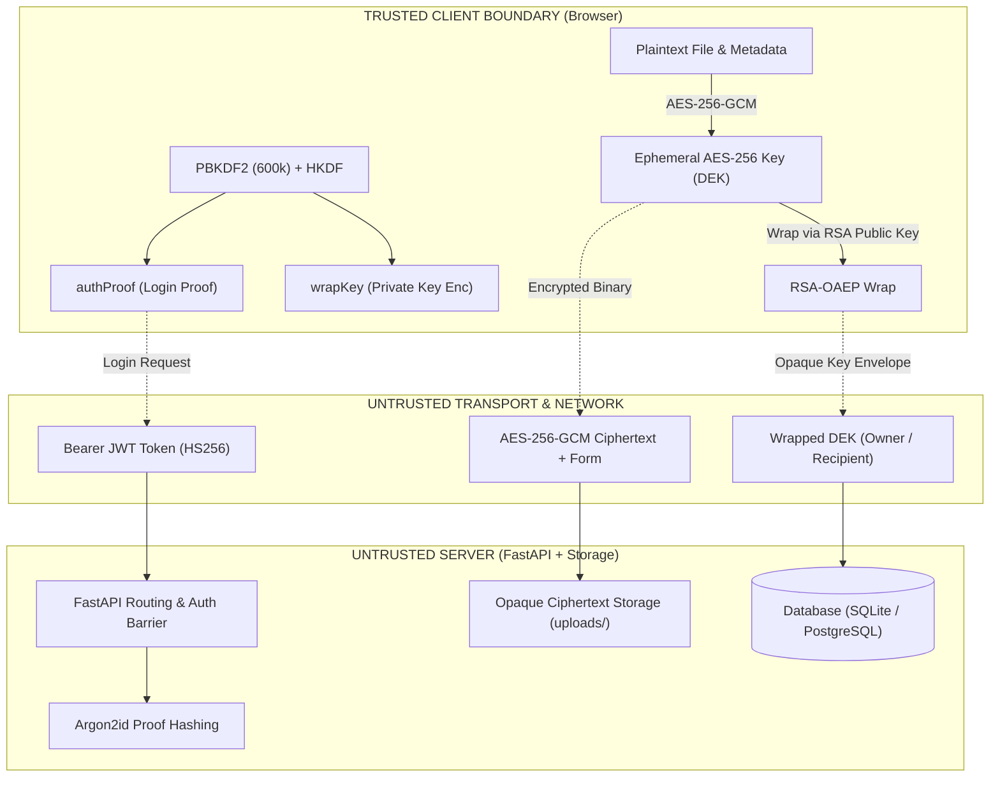

<div align="center">

<pre align="center">
██╗   ██╗ █████╗ ██╗   ██╗██╗  ████████╗██╗     ██╗███╗   ██╗███████╗
██║   ██║██╔══██╗██║   ██║██║  ╚══██╔══╝██║     ██║████╗  ██║██╔════╝
██║   ██║███████║██║   ██║██║     ██║   ██║     ██║██╔██╗ ██║█████╗  
╚██╗ ██╔╝██╔══██║██║   ██║██║     ██║   ██║     ██║██║╚██╗██║██╔══╝  
 ╚████╔╝ ██║  ██║╚██████╔╝███████╗██║   ███████╗██║██║ ╚████║███████╗
  ╚═══╝  ╚═╝  ╚═╝ ╚═════╝ ╚══════╝╚═╝   ╚══════╝╚═╝╚═╝  ╚═══╝╚══════╝
</pre>

### **Zero-Knowledge Encrypted File Vault with Cryptographic Envelope Sharing**

*A modern web vault that guarantees true end-to-end privacy through client-side Web Crypto primitives, multi-party envelope encryption, and mathematically isolated access control.*

[](https://react.dev/)
[](https://fastapi.tiangolo.com/)
[](https://developer.mozilla.org/en-US/docs/Web/API/Web_Crypto_API)
[](https://www.postgresql.org/)
[](docs/TESTING.md)
[](LICENSE)
[](STATUS.md)

[Guided Walkthrough (`/demo`)](http://localhost:5173/demo) • [System Architecture](docs/ARCHITECTURE.md) • [Security Threat Model](docs/SECURITY.md) • [API Specification](docs/API_REFERENCE.md) • [Evaluation Guide](docs/DEMO_GUIDE.md) • [Team Journal](journals/COMBINED_TEAM_JOURNAL.md)

</div>

---

## Executive Overview

**Vaultline** solves a fundamental vulnerability of commercial cloud storage: **untrusted server visibility**. In conventional architectures, cloud providers possess decryption keys, can inspect document content, leak metadata through operational logs, and are subject to server-side insider threats or unauthorized subpoena extraction.

Vaultline enforces a mathematically proven zero-knowledge security boundary:

1. **Client-Side Plaintext Boundary:** Files and their metadata (filenames, MIME types, sizes) are encrypted in browser memory via AES-256-GCM before any network dispatch.
2. **Envelope Key Cryptography:** Each file generates an ephemeral Data Encryption Key (DEK). The server never possesses DEKs; it only stores opaque DEKs wrapped under authorized recipients' RSA-OAEP public keys.
3. **Cryptographic Privilege Separation:** Master passwords never leave browser memory. Authentication proofs and key-wrapping keys are split via PBKDF2 (600,000 iterations) and HKDF domain separation.
4. **Instant Multi-Party Sharing:** Secure sharing is accomplished by re-wrapping the file's DEK with the recipient's RSA public key without re-encrypting or re-uploading file bytes.
5. **Zero-Setup Evaluator Mode:** An integrated 5-chapter interactive demonstration at `/demo` allows instant visual auditing of cryptographic guarantees without requiring local PostgreSQL setup or user registration.

---

## Architecture & Trust Boundaries



```text
┌─────────────────────────────────────────────────────────────────────────────────────────────┐
│                              TRUSTED BOUNDARY: CLIENT BROWSER                               │
│                                                                                             │
│   ┌───────────────────────────┐      ┌───────────────────────────┐      ┌────────────────┐  │
│   │    User Authentication    │      │    Envelope Encryption    │      │  Web UI / Demo │  │
│   │  Password + Random Salt   │      │   AES-256-GCM (DEK)       │      │   React 18.3   │  │
│   │           │               │      │   Content IV / Meta IV    │      │  Editorial UX  │  │
│   │      PBKDF2-SHA256        │      │   RSA-OAEP Key Wrapping   │      │  5-Step Walk-  │  │
│   │           │ (600k iter)   │      │   No Plaintext Leakage    │      │    through     │  │
│   │         HKDF              │      └─────────────┬─────────────┘      └────────────────┘  │
│   │     ┌─────┴─────┐         │                    │                                        │
│   │     ▼           ▼         │                    ▼                                        │
│   │ authProof   wrapKey       │             Encrypted Payload                               │
│   │ (Base64)    (In-Memory)   │             (Ciphertext + Form)                             │
│   └─────┬─────────────────────┘                    │                                        │
└─────────┼──────────────────────────────────────────┼────────────────────────────────────────┘
          │ POST /api/auth/register, /login          │ POST /api/files/upload, /sharing
          ▼                                          ▼
┌─────────────────────────────────────────────────────────────────────────────────────────────┐
│                            UNTRUSTED BOUNDARY: FASTAPI BACKEND                              │
│                                                                                             │
│   ┌───────────────────────────┐      ┌───────────────────────────┐      ┌────────────────┐  │
│   │    Security & Identity    │      │      Storage Engine       │      │ Database Layer │  │
│   │  Argon2id Proof Hashing   │      │  Opaque Ciphertext Writes │      │   SQLAlchemy   │  │
│   │  JWT Access Tokens (HS256)│      │  Zero Knowledge of DEK    │      │ SQLite/Postgres│  │
│   │  CORS & Rate Guardrails   │      │  Upload Size Enforcement  │      │ Users/Files/   │  │
│   │  Negative Access Controls │      │  Streamed Octet Downloads │      │ Shares Tables  │  │
│   └───────────────────────────┘      └───────────────────────────┘      └────────────────┘  │
└─────────────────────────────────────────────────────────────────────────────────────────────┘
```

---

## Core Security Features

| Security Feature | Implementation Specification | Security Guarantee |
|---|---|---|
| **File Content Encryption** | AES-256-GCM with 96-bit random IV | Confidentiality and 128-bit authentication tag integrity |
| **Metadata Encryption** | AES-256-GCM with distinct random IV | Prevents filename, file size, and MIME-type leakage |
| **Key Hierarchy** | Envelope encryption with RSA-OAEP (3072-bit, SHA-256) | File keys never stored unencrypted; multi-party sharing without file duplication |
| **Master Key Separation** | PBKDF2-SHA-256 (600k iterations) + HKDF-SHA-256 | Domain separation: `authProof` (login) $\neq$ `wrapKey` (private key wrapping) |
| **Zero-Knowledge Auth** | Argon2id verification of client-derived `authProof` | Master passwords and wrapped private keys never transmittable to server |
| **Ephemeral Memory Model** | Ephemeral JavaScript React Context state | Unwrapped private keys exist only in volatile RAM; destroyed on logout/refresh |

---

## Interactive In-Website Tour (`/demo`)

To evaluate the full zero-knowledge workflow without setting up backend services or databases, open the built-in 5-chapter interactive walkthrough:

```text
http://localhost:5173/demo
```

| Chapter | Interactive Operation | Cryptographic Insight Revealed |
|---|---|---|
| **1. Overview** | Inspect simulated unlocked vault | Demonstrates in-memory state and UI layout hierarchy |
| **2. Encrypt** | Live AES-256-GCM byte transformation | Visualizes independent payload and metadata IV generation |
| **3. Share** | Lookup recipient public key and re-wrap DEK | Proves files are shared without re-uploading ciphertext |
| **4. Open** | Unwrap RSA key and verify 128-bit GCM tag | Shows mathematical integrity validation before download |
| **5. Proof** | Audit cryptographic parameters & invariants | Complete breakdown of STRIDE mitigations and key lifecycle |

---

## Quickstart Runbook

### Prerequisites
- **Node.js**: v18.0.0+ (Tested on Node 20+)
- **Python**: v3.10+ (Tested on Python 3.12 and 3.14)
- **Git**: Modern Git CLI

### 1. Launch the Backend API Service

```powershell
# Open terminal 1: Navigate to backend
cd backend-integration

# Create and activate virtual environment
python -m venv .venv
.\.venv\Scripts\Activate.ps1   # On macOS/Linux: source .venv/bin/activate

# Install dependencies (pinned Python 3.14 compatible)
pip install -r requirements.txt

# Start FastAPI application with auto-reload
python -m uvicorn app.main:app --host 127.0.0.1 --port 8000 --reload
```
*Backend runs at `http://127.0.0.1:8000` (Swagger docs: `http://127.0.0.1:8000/docs`). Uses zero-config SQLite (`vaultline.db`) by default.*

### 2. Launch the Frontend Web Application

```powershell
# Open terminal 2: From project root directory
npm install

# Start Vite development server
npm run dev
```
*Frontend opens at `http://localhost:5173`. Proxies `/api` traffic automatically to `:8000`.*

---

## Automated Verification Gates

Vaultline includes comprehensive test suites across both frontend and backend layers:

```powershell
# Run complete frontend test, lint, and production build gate
npm run verify

# Run backend integration and security test suite
cd backend-integration
.\.venv\Scripts\python -m pytest tests -q
```

### Verified Test Matrix

| Verification Gate | Test Scope / Target | Result |
|---|---|:---:|
| **ESLint** | Code quality, undefined variables, React hooks invariants | `PASS` |
| **Crypto Unit Tests** | PBKDF2 derivation determinism & RSA key wrapping recovery | `PASS` |
| **Transport Boundary Tests** | Axios multipart boundary preservation (preventing JSON mutation) | `PASS` |
| **Vite Production Build** | Static bundle compilation, tree-shaking, CSS optimization | `PASS` |
| **Salt Persistence Test** | Verifies exact client salt persistence across repeat logins | `PASS` |
| **Auth & JWT Security** | Argon2 proof verification, invalid token rejection, `/auth/me` | `PASS` |
| **Encrypted File Lifecycle** | Authenticated upload, list, encrypted download, owner deletion | `PASS` |
| **Negative Access Controls** | Recipient access block, unauthorized share list/delete block | `PASS` |
| **Security Audit** | npm audit (0 vulnerabilities), Git conflict & secret pattern scans | `PASS` |

---

## Repository Structure

```text
Vaultline-Secure-file-vault/
├── src/                               # Frontend Client (React 18 + Vite)
│   ├── api/                           # HTTP client configuration and endpoint map
│   │   ├── client.js                  # Axios instance with Bearer interceptor
│   │   └── endpoints.js               # Normalized /api route definitions
│   ├── components/                    # UI component library (modals, forms, buttons)
│   ├── context/                       # In-memory authentication & session state
│   ├── crypto/                        # Web Crypto API cryptographic pipeline
│   │   ├── crypto.test.js             # Vitest suite for derivation and wrapping
│   │   ├── fileCrypto.js              # AES-256-GCM file & metadata encryption
│   │   ├── keyManagement.js           # RSA-OAEP 3072 key generation & wrapping
│   │   └── passwordAuth.js            # PBKDF2-SHA256 & HKDF domain split
│   ├── hooks/                         # Vault state orchestration (useFiles, useAuth)
│   ├── pages/                         # Application views (Landing, Demo, Dashboard)
│   │   ├── ProductDemoPage.jsx        # 5-Chapter interactive walkthrough
│   │   └── LandingPage.jsx            # Modern Apple-inspired landing interface
│   ├── services/                      # Service adapters connecting UI to API
│   │   ├── fileService.js             # Multipart upload & octet stream handling
│   │   └── fileService.test.js        # Boundary test for FormData integrity
│   └── styles/                        # CSS variables & typography design tokens
├── backend-integration/               # Backend API Service (FastAPI + SQLAlchemy)
│   ├── app/
│   │   ├── config.py                  # Environment config & production secret guards
│   │   ├── database.py                # Engine initialization & session factory
│   │   ├── models.py                  # SQLAlchemy models (User, File, Share)
│   │   ├── routers/                   # API route handlers (auth, files, sharing)
│   │   ├── schemas/                   # Pydantic validation schemas
│   │   └── utils/                     # Argon2id hashing & JWT HS256 utilities
│   ├── tests/                         # Pytest integration and authorization suite
│   │   └── test_api.py                # Repeat login, sharing, and authorization tests
│   └── requirements.txt               # Pinned Python dependencies
├── docs/                              # Canonical Technical Documentation Set
│   ├── ARCHITECTURE.md                # Sequence diagrams, data models, and trust maps
│   ├── SECURITY.md                    # Threat model, STRIDE analysis, and invariants
│   ├── API_REFERENCE.md               # Complete REST API endpoint reference
│   ├── DEMO_GUIDE.md                  # Evaluator demo script & Q&A preparation
│   ├── TESTING.md                     # Test execution matrix & quality gates
│   └── README.md                      # Documentation index and navigation map
├── journals/                          # Engineering Logs & Incident Retrospectives
│   ├── 1024030315-Vikramaditya/       # Vikramaditya's individual engineering log
│   ├── 1024030318-sukhanshmittal/     # Sukhansh Mittal's individual engineering log
│   ├── 1024030327-Ishjaap-Singh/      # Ishjaap Singh's individual engineering log
│   └── COMBINED_TEAM_JOURNAL.md       # Full multi-contributor collaborative journal
├── LICENSE                            # Canonical MIT License
├── STATUS.md                          # Release candidate readiness & capability matrix
├── DEPLOYMENT_GUIDE.md                # Local, classroom, and production deployment
└── CHANGELOG.md                       # Structured release notes and incident history
```

---

## Technical Limitations & Responsible Disclosure

Vaultline is an advanced academic release candidate and proof-of-concept for zero-knowledge web systems. To maintain absolute technical honesty, the following known constraints are explicitly documented:

1. **In-Memory File Buffering:** Files are currently encrypted and buffered as continuous byte arrays in browser and API memory. Multi-gigabyte file streaming will require chunked AES-GCM framing with monotonic nonce sequences.
2. **Cryptographic Revocation (Forward Secrecy):** When file access is revoked for a recipient, server-side access grants are purged. Cryptographic forward secrecy requires re-encrypting the file with a fresh DEK and re-wrapping only for remaining authorized recipients.
3. **Public Key Infrastructure (PKI):** Public keys are stored and retrieved from the server. A compromised server could theoretically perform a public-key substitution attack. Production deployment requires key pinning or a signed transparency log.

---

## Contributors & Academic Attribution

| Contributor | Registration / Roll No. | Primary System Contributions |
|---|---|---|
| **Ishjaap Singh** | `1024030327` | **Full-Stack Integration Lead:** Diagnosed & resolved the critical salt regeneration defect; restored persistent SQLAlchemy auth with Argon2id and signed JWTs; eliminated the Axios multipart JSON mutation bug; overhauled the UI with an Apple-inspired editorial design system; engineered the 5-chapter interactive in-website demo (`/demo`); authored automated test suites, architectural diagrams, and canonical release documentation. |
| **Vikramaditya** | `1024030315` | **Frontend Architecture:** Engineered the React 18 component tree, Web Crypto API envelope encryption pipeline (DEK generation & wrapping), client-side metadata encryption, and mock service boundary. |
| **Sukhansh Mittal** | `1024030318` | **Backend Foundation:** Configured FastAPI application structure, SQLAlchemy relational database models, Alembic migration environment, and Python 3.14 dependency triage. |

---

## License

This project was built for academic evaluation and research purposes under the [MIT License](LICENSE).
