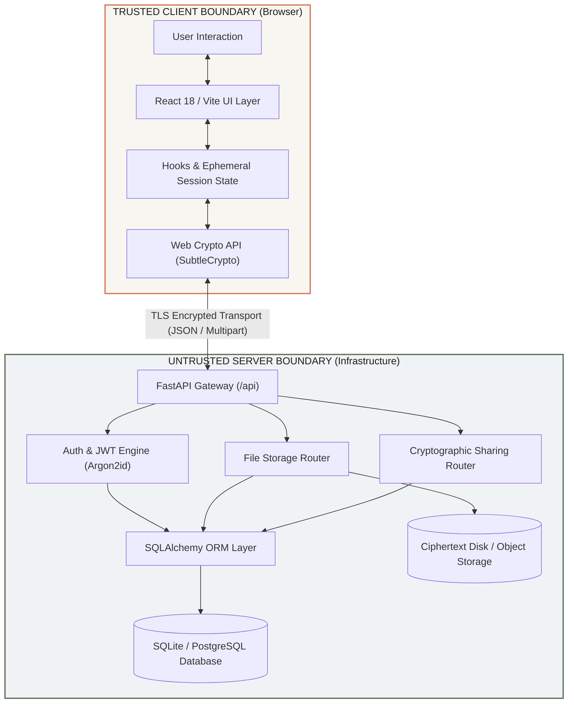
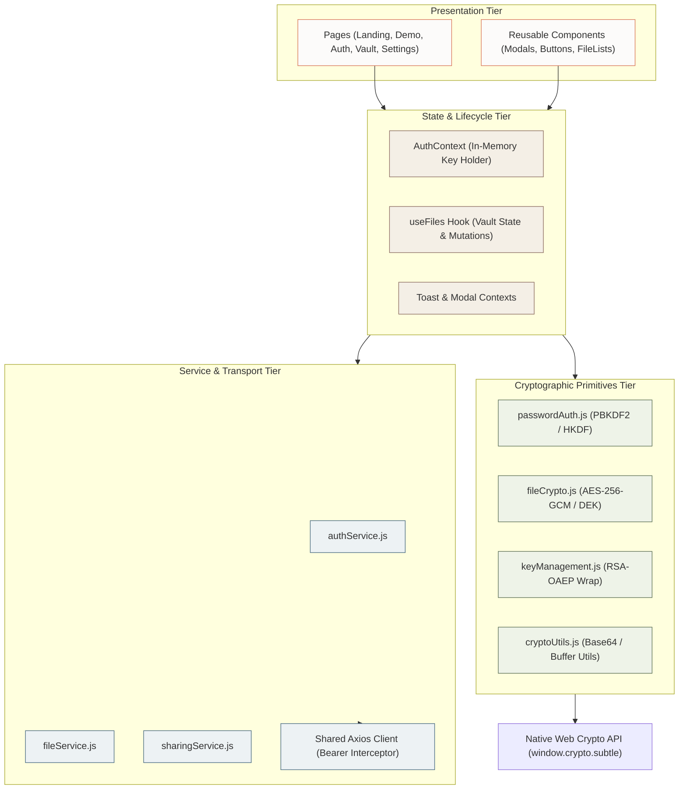
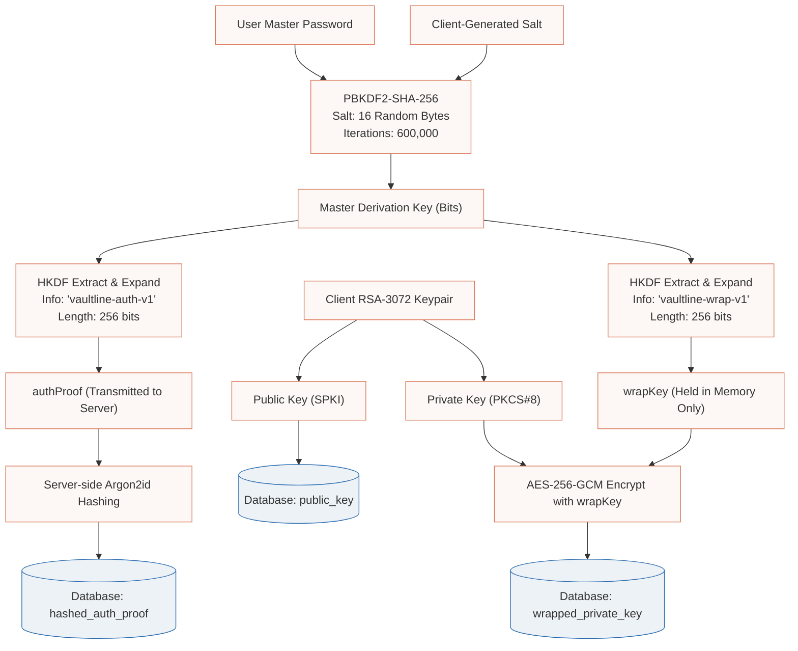
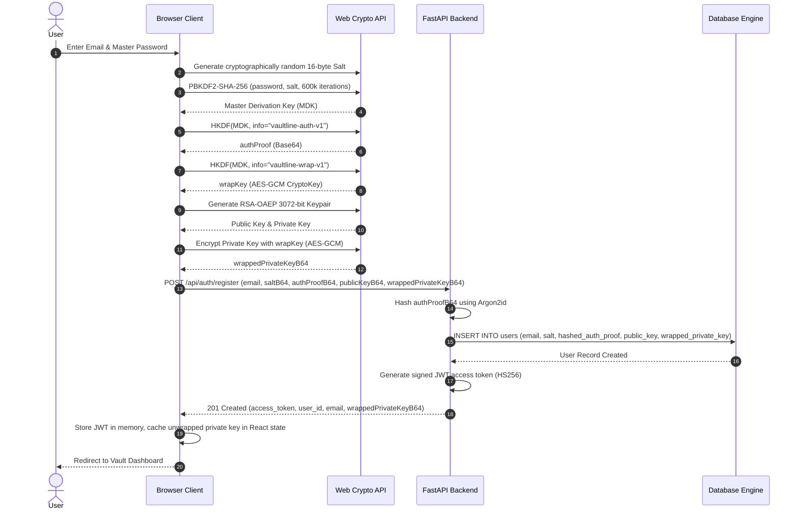
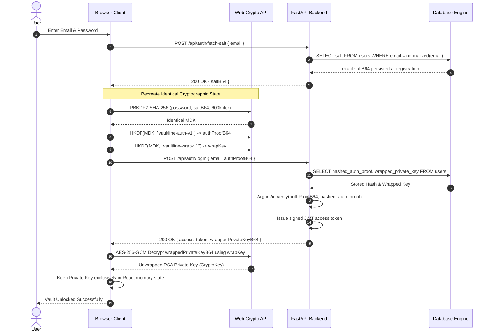
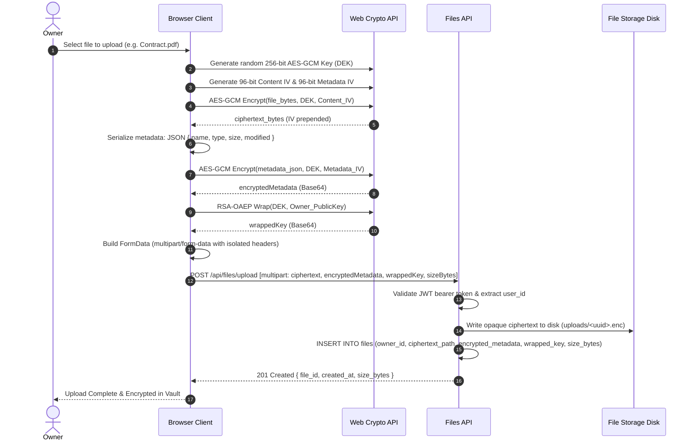
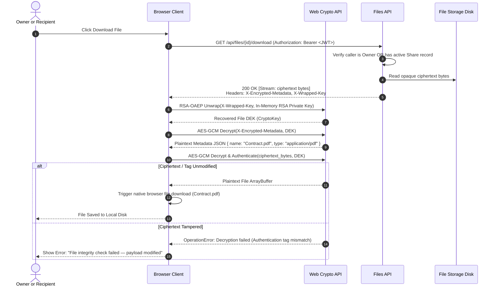
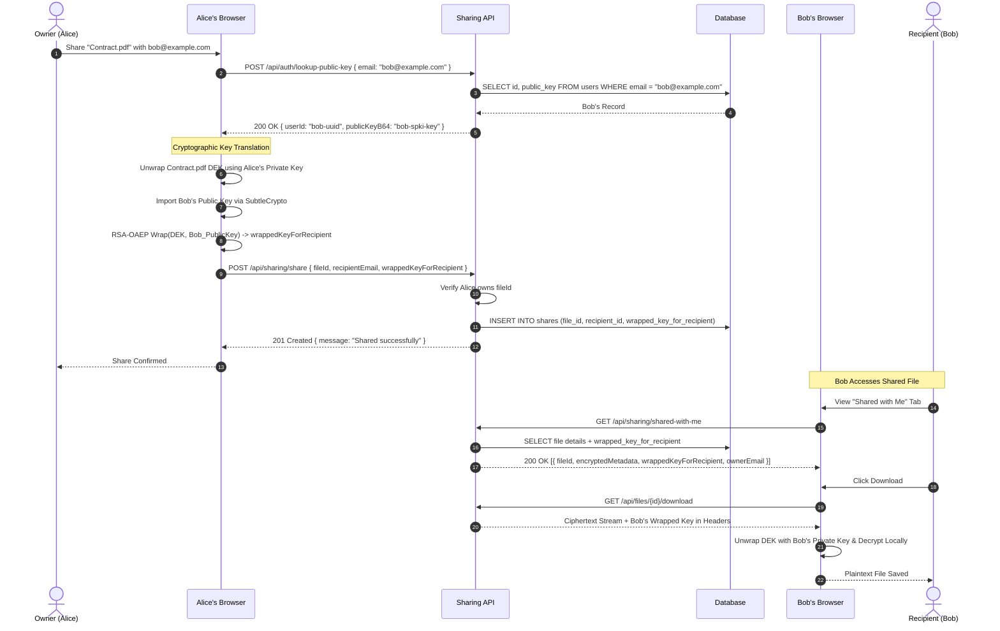
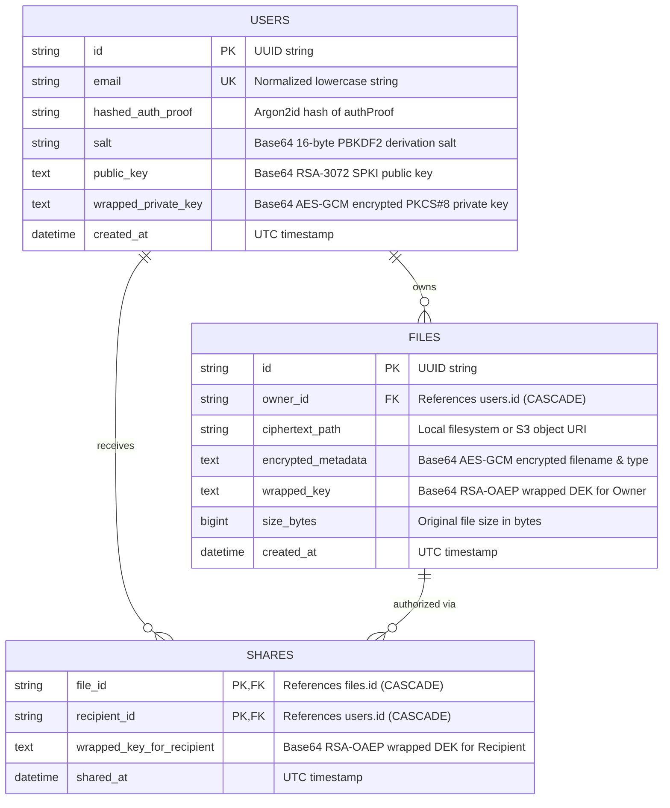
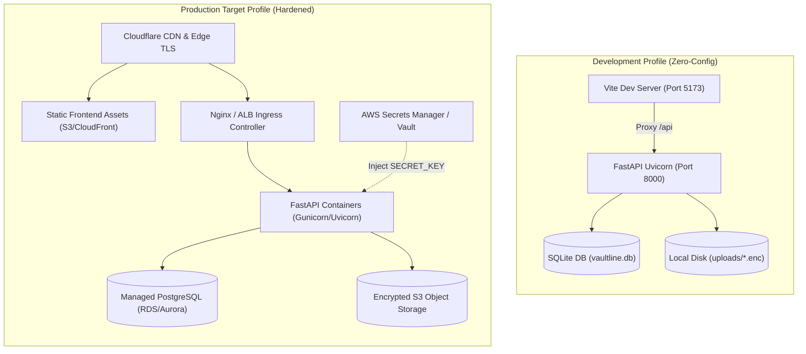

# Vaultline System Architecture & Cryptographic Specification

```text
  ██╗   ██╗ █████╗ ██╗   ██╗██╗  ████████╗██╗     ██╗███╗   ██╗███████╗
  ██║   ██║██╔══██╗██║   ██║██║  ╚══██╔══╝██║     ██║████╗  ██║██╔════╝
  ██║   ██║███████║██║   ██║██║     ██║   ██║     ██║██╔██╗ ██║█████╗  
  ╚██╗ ██╔╝██╔══██║██║   ██║██║     ██║   ██║     ██║██║╚██╗██║██╔══╝  
   ╚████╔╝ ██║  ██║╚██████╔╝███████╗██║   ███████╗██║██║ ╚████║███████╗
    ╚═══╝  ╚═╝  ╚═╝ ╚═════╝ ╚══════╝╚═╝   ╚══════╝╚═╝╚═╝  ╚═══╝╚══════╝
                     CORE ARCHITECTURAL BLUEPRINT
```

---

## 1. Architectural Philosophy & Trust Boundary

Vaultline is architected around a strict security boundary: **usable plaintext and private keys exist exclusively within browser memory**. The backend services, transport layers, database engines, and storage systems are **untrusted by design**.

The server authenticates users, enforces authorization rules, persists encrypted blobs, and coordinates public keys and wrapped key exchanges without possessing the mathematical capability to decrypt user files or read filenames.



### Text Architectural Schematic

```text
┌────────────────────────────────────────────────────────────────────────────────────────┐
│                        TRUSTED ZONE: CLIENT BROWSER (PLAINTEXT)                        │
│                                                                                        │
│   Master Password ────────► PBKDF2-SHA256 (600,000 iter) ──► Master Derivation Key     │
│                                                                        │               │
│                                            ┌───────────────────────────┴──────────┐    │
│                                            ▼                                      ▼    │
│                                  HKDF("vaultline-auth-v1")              HKDF("vaultline-wrap-v1")
│                                            │                                      │    │
│                                            ▼                                      ▼    │
│                                       authProofB64                           wrappingKey
│                                            │                                      │    │
│                                            │                             Decrypts/Encrypts
│                                            │                                      │    │
│                                            │                                      ▼    │
│   Plaintext File ──► AES-256-GCM (DEK) ──► Ciphertext                     RSA Private Key
│                            │                                                           │
│                            └───────────────── RSA-OAEP Wrap ───────────────────────────┘
│                                                     │
└─────────────────────────────────────────────────────┼──────────────────────────────────┘
                                                      │ HTTPS / TLS Transport
┌─────────────────────────────────────────────────────▼──────────────────────────────────┐
│                     UNTRUSTED ZONE: BACKEND & STORAGE (CIPHERTEXT ONLY)                │
│                                                                                        │
│   authProofB64 ────────► Argon2id Hash ────────► Stored in Database                    │
│   Ciphertext ──────────► Disk Storage ─────────► Opaque Binary Storage                 │
│   Wrapped DEK ─────────► Database ─────────────► Stored per Authorized User            │
│   Metadata (Encrypted) ► Database ─────────────► Server Cannot Read Filenames          │
└────────────────────────────────────────────────────────────────────────────────────────┘
```

---

## 2. Frontend Layering & Modular Decoupling

The frontend code separates UI presentation, session lifecycle orchestration, HTTP transport, and cryptographic primitives into discrete layers to prevent leaks and make testing modular.



---

## 3. Cryptographic Key Derivation & Hierarchy

Vaultline employs strict **domain separation** through HKDF. A single master password cannot both authenticate the user and decrypt files directly without explicit derivation steps.



---

## 4. Dual-Stage Registration Sequence



---

## 5. Deterministic Repeat Login Sequence (Salt Recovery)

This diagram highlights the solution to the **salt replacement incident**, showing how the exact persisted client salt is recovered to unlock the vault.



---

## 6. Encrypted File Upload & Envelope Generation



---

## 7. Encrypted File Download & Integrity Verification



---

## 8. Multi-Party Secure Sharing & Key Distribution

Sharing never requires re-encrypting the original file or transmitting user passwords. The Data Encryption Key (DEK) is simply wrapped for the recipient.



---

## 9. Access Revocation Sequence

```mermaid
sequenceDiagram
    autonumber
    actor Alice as Owner (Alice)
    participant Browser as Alice's Browser
    participant API as Sharing API
    participant DB as Database
    actor Bob as Revoked Recipient (Bob)

    Alice->>Browser: Revoke Bob's access to "Contract.pdf"
    Browser->>API: DELETE /api/sharing/revoke { fileId, recipientEmail: "bob@example.com" }
    API->>API: Verify caller is File Owner
    API->>DB: DELETE FROM shares WHERE file_id = fileId AND recipient_id = bob_id
    DB-->>API: 1 Row Deleted
    API-->>Browser: 200 OK { message: "Access revoked successfully" }
    Browser-->>Alice: Bob's Grant Removed from UI

    Note over Bob,API: Bob Attempts Unauthorized Download
    Bob->>API: GET /api/files/{id}/download (Bob's JWT)
    API->>DB: Check if Bob is Owner OR in shares
    DB-->>API: No matching grant
    API-->>Bob: 404 Not Found (Silent rejection; existence concealed)
```

---

## 10. Relational Database Entity-Relationship (ER) Diagram



---

## 11. Deployment Topology & Environments



---

## 12. Summary of Cryptographic Invariants

1. **No Plaintext on Wire:** Plaintext passwords, private keys, filenames, and file bodies are never transmitted over network protocols.
2. **Ephemeral Private Key:** The unwrapped RSA private key exists only in JavaScript heap memory during an active session and is never persisted to `localStorage`, `sessionStorage`, cookies, or IndexedDB.
3. **Independent Initialization Vectors:** Every AES-GCM encryption operation draws a freshly generated cryptographically secure 96-bit random IV. IV reuse across identical keys is mathematically prevented.
4. **Authenticity Enforcement:** All AES-GCM ciphertexts include a 128-bit authentication tag. Altered ciphertexts are rejected before buffer release.
5. **Ownership Isolation:** API routes derive caller identity strictly from verified cryptographically signed JWT tokens, completely ignoring client-supplied user IDs.
